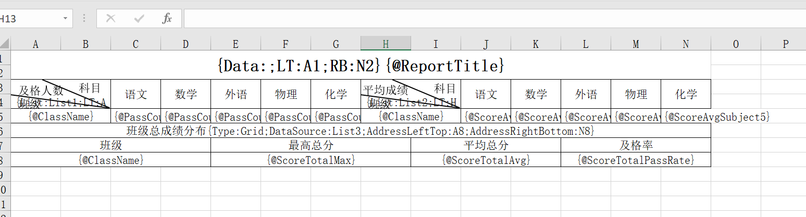

# ExcelCake

基于 EPPlus 开发的 Excel(支持 excel 2007 及之后版本)通用导入导出类库(支持.net core)。

[](./LICENSE)
[](https://github.com/JanKallman/EPPlus)


## 分支说明
- master:默认分支,不接受合并。
- Dev:开发分支，接收合并。支持.net core 3.1及以上。
- OldVersion:旧版本分支(.net3.5、.net4.0、.net standard 2.0、.net standard 2.1版本代码)。有需要可以下载此分支。不承诺该分支的维护工作。

## 特性

- 快速实现 Excel 导入导出功能
- ~~老旧项目(.net 3.5、.net 4.0、.net standard 2.0、.net standard 2.1)支持~~(旧版本代码移步至OldVersion分支)
- 跨平台支持(.net core 3.1及以上)
- 多种实现机制:1.基于特性实现的导入导出(侵入式) 2.基于模板实现的导入导出(非侵入式) 3.读取配置实现导出(非侵入式)

## ExcelCake 源码结构

```
|--ExcelCake                 源码
|----Intrusive             侵入式部分
|----NoIntrusive           非侵入式部分
|--ExcelCake.Example         Demo
|--ExcelCake.Test            单元测试
```

## **作者相关**

github: https://github.com/winstonwxj

gitee: <https://gitee.com/winstonwxj>(不再维护)

## 路线图

- 基于特性数据导出(已实现)
- 基于特性数据导入(已实现)
- 基于特性图片导出
- 基于特性图表导出
- 基于模板表格导出(已实现)
- 基于模板表格导入
- 基于模板图片导出
- 基于模板图表导出
- 基于配置数据动态导出
- 基于配置数据动态导入
- 基于配置图片动态导出
- 基于配置图标动态导出
- 使用其他office open xml实现替代EPPlus

## 模板语法
### （新版语法）
**语法可用的最小粒度为配置项，每个配置项使用大括号包裹，各项之间以分号”;”分隔，项和值之间以冒号”:”分隔，忽略大小写。地址配置项为Address时，值以,分隔。**
- Data:数据源，该项值为数据源中的成员变量，类型必须为属性（含get，set），不支持字段,Type不为Value时可用。如果Value配置字段为数据源直接属性，该项为空。用于Free配置类型(自由格式配置)
- List:数据源，该项值为数据源中的成员变量，类型必须为属性（含get，set），不支持字段,Type不为Value时可用。如果Value配置字段为数据源集合单个实体的直接属性，该项为空。用于Grid配置类型(表格格式配置)该项值为数据源中的成员变量，类型必须为属性（含get，set），不支持字段,Type不为Value时可用。如果Value配置字段为数据源直接属性，该项为空。
- @:填充字段名称
LT:区域左上角单元格坐标,Type不为Value时可用
RB:区域右下角单元格坐标,Type不为Value时可用
Address:指定区域地址，以,号分隔的“区域左上角单元格坐标”和“区域右下角单元格坐标”

**配置示例：**
1. 自由格式
{Data:具体对象;LT:区域左上坐标;RB:区域右下坐标}
或{Data:具体对象;Address:区域左上坐标,区域右下坐标}
2. 表格格式
{List:具体对象(集合类型，不支持数组);LT:区域左上坐标;RB:区域右下坐标}
或{List:具体对象(集合类型，不支持数组);Address:区域左上坐标,区域右下坐标}
3. 具体填充字段名称
{@字段名称}

### （新版语法）
**语法可用的最小粒度为配置项，每个配置项使用大括号包裹，各项之间以分号”;”分隔，项和值之间以冒号”:”分隔，忽略大小写。地址配置项为Address时，值以,分隔。**
- Type:配置类型，包括Free(自由格式配置),Grid(表格格式配置),Value(填充字段配置)
- DataSource:数据源，该项值为数据源中的成员变量，类型必须为属性（含get，set），不支持字段,Type不为Value时可用。如果Value配置字段为数据源直接属性，该项为空。
- AddressLeftTop:区域左上角单元格坐标,Type不为Value时可用
- AddressRightBottom:区域右下角单元格坐标,Type不为Value时可用
- Field:字段名称，Type为Value时可用

**配置示例：**
1. 自由格式
{Type:Free;DataSource:具体对象;AddressLeftTop:区域左上坐标;AddressRightBottom:区域右下坐标}
2. 表格格式
{Type:Grid;DataSource:具体对象(集合类型，不支持数组);AddressLeftTop:区域左上坐标;AddressRightBottom:区域右下坐标}
3. 具体填充字段名称
{Type:Value;Field:字段名称}


## 示例

### 基于特性部分
#### 实体类定义

```C#
    [ExportEntity(EnumColor.LightGray,"用户信息")]
    [ImportEntity(titleRowIndex:1,headRowIndex:2,dataRowIndex:4)]
    public class UserInfo: ExcelBase
    {
        [Export(name:"编号", index:1,prefix:"ID:")]
        [Import(name:"编号",prefix:"ID:")]
        public int ID { set; get; }

        [Export("姓名", 2)]
        [Import("姓名")]
        public string Name { set; get; }

        [Export("性别", 3)]
        [Import("性别")]
        public string Sex { set; get; }

        [Export(name:"年龄", index:4,suffix:"岁")]
        [Import(name:"年龄",suffix:"岁",dataVerReg: @"^[1-9]\d*$", isRegFailThrowException:false)]
        public int Age { set; get; }

        [ExportMerge("联系方式")]
        [Export("电子邮件", 5)]
        [Import("电子邮件")]
        public string Email { set; get; }

        [ExportMerge("联系方式")]
        [Export("手机", 6)]
        [Import("手机")]
        public string TelPhone { set; get; }

        public override string ToString()
        {
            return string.Format($"ID:{ID},Name:{Name},Sex:{Sex},Age:{Age},Email:{Email},TelPhone:{TelPhone}");
        }
    }

    [ExportEntity("账号信息")]
    public class AccountInfo:ExcelBase
    {
        [Export("编号", 1)]
        public int ID { set; get; }

        [Export("昵称", 2)]
        public string Nickname { set; get; }

        [Export("密码", 3)]
        public string Password { set; get; }

        [Export("旧密码", 4)]
        public string OldPassword { set; get; }

        [Export("状态", 5)]
        public int AccountStatus { set; get; }
    }
```

#### 基于特性导出
```C#
    private static void IntrusiveExport()
    {
        List<UserInfo> list = new List<UserInfo>();
        string[] sex = new string[] { "男", "女" };
        Random random = new Random();
        for (var i = 0; i < 100; i++)
        {
            list.Add(new UserInfo()
            {
                ID = i + 1,
                Name = "Test" + (i + 1),
                Sex = sex[random.Next(2)],
                Age = random.Next(20, 50),
                Email = "test" + (i + 1) + "@163.com",
                TelPhone = "1399291" + random.Next(1000, 9999)
            });
        }
        var temp = list.ExportToExcelBytes(); //导出为byte[]

        var path = Path.Combine(AppDomain.CurrentDomain.BaseDirectory, "Export");
        if (!Directory.Exists(path))
        {
            Directory.CreateDirectory(path);
        }
        var exportTitle = "导出文件";
        var filePath = Path.Combine(path, exportTitle + DateTime.Now.Ticks + ".xlsx");
        FileInfo file = new FileInfo(filePath);
        File.WriteAllBytes(file.FullName, temp);
        Console.WriteLine("IntrusiveExport导出完成!");
    }
```


#### 基于特性多sheet多类型导出
```C#
    private static void IntrusiveMultiSheetExport()
    {
        Dictionary<string, IEnumerable<ExcelBase>> excelSheets = new Dictionary<string, IEnumerable<ExcelBase>>();

        List<UserInfo> list = new List<UserInfo>();
        List<AccountInfo> list2 = new List<AccountInfo>();
        string[] sex = new string[] { "男", "女" };

        Random random = new Random();
        for (var i = 0; i < 10000; i++)
        {
            list.Add(new UserInfo()
            {
                ID = i + 1,
                Name = "Test" + (i + 1),
                Sex = sex[random.Next(2)],
                Age = random.Next(20, 50),
                Email = "testafsdgfashgawefqwefasdfwefqwefasdggfaw" + (i + 1) + "@163.com",
                TelPhone = "1399291" + random.Next(1000, 9999)
            });
            list2.Add(new AccountInfo()
            {
                ID = i + 1,
                Nickname = "nick" + (i + 1),
                Password = random.Next(111111, 999999).ToString(),
                OldPassword = random.Next(111111, 999999).ToString(),
                AccountStatus = random.Next(2)
            });
        }
        excelSheets.Add("sheet1", list);
        excelSheets.Add("sheet2", list2);


        var temp = excelSheets.ExportMultiToBytes(); //导出为byte[]

        var path = Path.Combine(AppDomain.CurrentDomain.BaseDirectory, "Export");
        if (!Directory.Exists(path))
        {
            Directory.CreateDirectory(path);
        }
        var exportTitle = "导出文件";
        var filePath = Path.Combine(path, exportTitle + DateTime.Now.Ticks + ".xlsx");
        FileInfo file = new FileInfo(filePath);
        File.WriteAllBytes(file.FullName, temp);
        Console.WriteLine("IntrusiveMultiSheetExport导出完成!");
    }
```


#### 导入Excel文件结构


#### 基于特性导入
```C#
    private static void IntrusiveImport()
    {
        var list = ExcelHelper.GetList<UserInfo>(@"C:\Users\winstonwxj\Desktop\导入文件测试.xlsx");
        foreach(var item in list)
        {
            Console.WriteLine(item);
        }
        Console.WriteLine("导入完成!");
    }
```


### 基于模板部分
#### 模板绘制
(旧版语法)
(新版语法)

#### 基于模板导出
```C#
    private static void NoIntrusiveExport()
    {
        var reportInfo = new GradeReportInfo();
        var exportTitle = "2018学年期中考试各班成绩汇总";
        reportInfo.ReportTitle = exportTitle;
        var templateFileName = "复杂格式测试模板.xlsx";

        #region 构造数据
        var list1 = new List<ClassInfo>();
        list1.Add(new ClassInfo()
        {
            ClassName = "班级1",
            PassCountSubject1 = 20,
            PassCountSubject2 = 15,
            PassCountSubject3 = 10,
            PassCountSubject4 = 13,
            PassCountSubject5 = 25
        });
        list1.Add(new ClassInfo()
        {
            ClassName = "班级2",
            PassCountSubject1 = 19,
            PassCountSubject2 = 20,
            PassCountSubject3 = 17,
            PassCountSubject4 = 11,
            PassCountSubject5 = 19
        });
        list1.Add(new ClassInfo()
        {
            ClassName = "班级3",
            PassCountSubject1 = 17,
            PassCountSubject2 = 23,
            PassCountSubject3 = 12,
            PassCountSubject4 = 16,
            PassCountSubject5 = 21
        });
        list1.Add(new ClassInfo()
        {
            ClassName = "班级4",
            PassCountSubject1 = 23,
            PassCountSubject2 = 17,
            PassCountSubject3 = 16,
            PassCountSubject4 = 14,
            PassCountSubject5 = 22
        });
        list1.Add(new ClassInfo()
        {
            ClassName = "班级5",
            PassCountSubject1 = 23,
            PassCountSubject2 = 17,
            PassCountSubject3 = 16,
            PassCountSubject4 = 14,
            PassCountSubject5 = 22
        });
        var list2 = new List<ClassInfo>();
        list2.Add(new ClassInfo()
        {
            ClassName = "班级1",
            ScoreAvgSubject1 = 81.25,
            ScoreAvgSubject2 = 65.75,
            ScoreAvgSubject3 = 79.05,
            ScoreAvgSubject4 = 59.15,
            ScoreAvgSubject5 = 83.05
        });
        list2.Add(new ClassInfo()
        {
            ClassName = "班级2",
            ScoreAvgSubject1 = 79.25,
            ScoreAvgSubject2 = 63.75,
            ScoreAvgSubject3 = 71.05,
            ScoreAvgSubject4 = 62.15,
            ScoreAvgSubject5 = 85
        });
        list2.Add(new ClassInfo()
        {
            ClassName = "班级3",
            ScoreAvgSubject1 = 71.5,
            ScoreAvgSubject2 = 63.25,
            ScoreAvgSubject3 = 75.25,
            ScoreAvgSubject4 = 61.25,
            ScoreAvgSubject5 = 80.05
        });
        list2.Add(new ClassInfo()
        {
            ClassName = "班级4",
            ScoreAvgSubject1 = 84.5,
            ScoreAvgSubject2 = 61.25,
            ScoreAvgSubject3 = 75.25,
            ScoreAvgSubject4 = 57.35,
            ScoreAvgSubject5 = 81.5
        });
        var list3 = new List<ClassInfo>();
        list3.Add(new ClassInfo()
        {
            ClassName = "班级1",
            ScoreTotalMax = 432,
            ScoreTotalAvg = 315.25,
            ScoreTotalPassRate = 47.25
        });
        list3.Add(new ClassInfo()
        {
            ClassName = "班级2",
            ScoreTotalMax = 466.5,
            ScoreTotalAvg = 330.75,
            ScoreTotalPassRate = 44.75
        });
        list3.Add(new ClassInfo()
        {
            ClassName = "班级3",
            ScoreTotalMax = 422,
            ScoreTotalAvg = 345.25,
            ScoreTotalPassRate = 51.05
        });
        list3.Add(new ClassInfo()
        {
            ClassName = "班级4",
            ScoreTotalMax = 444,
            ScoreTotalAvg = 335.25,
            ScoreTotalPassRate = 46.15
        });
        #endregion

        reportInfo.List1 = list1;
        reportInfo.List2 = list2;
        reportInfo.List3 = list3;

        ExcelTemplate customTemplate = new ExcelTemplate(templateFileName);
        var byteInfo = customTemplate.ExportToBytes(reportInfo, "Template/复杂格式测试模板.xlsx");
        var path = Path.Combine(AppDomain.CurrentDomain.BaseDirectory, "Export");
        if (!Directory.Exists(path))
        {
            Directory.CreateDirectory(path);
        }
        var filePath = Path.Combine(path, exportTitle + DateTime.Now.Ticks + ".xlsx");
        FileInfo file = new FileInfo(filePath);
        File.WriteAllBytes(file.FullName, byteInfo);
        Console.WriteLine("NoIntrusiveExport导出完成!");
    }
```


## 文档
